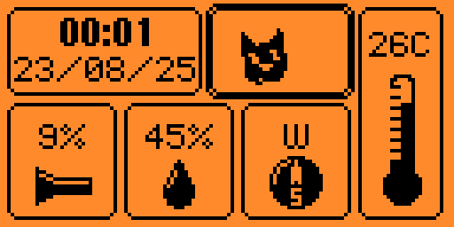

# Kiisu Sensor Hub

Explore Kiisu’s onboard sensors with a clean widget dashboard and focused detail pages. Provides a tilt‑compensated compass, a playful accelerometer view, temperature/humidity readouts, and a light meter.

## Features

- Home dashboard with time/date and five widgets:
  - Accelerometer: gravity “kitties” sim, level/bubble tool with snapping, raw XYZ with pitch/roll/yaw.
  - Magnetometer: tilt‑compensated, smoothed compass with 8‑wind labels; raw μT page.
  - Temperature: shows ambient (GXHTC3C) and LSM303 die temp, plus a centered average.
  - Humidity: live RH% from GXHTC3C.
  - Light: percentage and sensor voltage using ADC.
- Built‑in calibration flows:
  - Magnetometer: flat baseline average + timed figure‑eight; computes hard‑iron offsets and soft‑iron scales, programs LSM303.
  - Accelerometer leveling: 3‑second flat average for level baseline used by the level page and the kitty sim.
- Robust heading: tilt compensation using accel, vector smoothing, and update gating when tilted past ~60°.
- Homescreen mini‑kitty bouncing inside the accelerometer tile.

## Hardware and sensors

- LSM303 (accelerometer + magnetometer + die temperature) on the external I²C bus.
- GXHTC3C (SHTC3‑class) temperature/humidity on I²C.
- Light sensor via ADC (`kiisu_light_adc`).
- I²C bus handle: `furi_hal_i2c_handle_external`.

### Accelerometer pages

1) Kitties (gravity sim)
	- Five small sprites bounce with gravity from the accelerometer. Responds to yaw a bit for a lively feel.

2) Level tool
	- Auto‑chooses a bullseye (face‑up) or a bar (upright). Snaps to 0° within ±3° and shows a large degree readout.

3) Raw data
	- Shows X/Y/Z in g plus compact pitch/roll/yaw. Center/OK: start accelerometer leveling calibration (see below).

### Magnetometer pages

1) Compass
	- Full dial centered at the bottom with a static needle. Heading number and 8‑wind label at the top.

2) Raw values
	- Shows μT (X/Y/Z), min/max during calibration, and calibration status. Center/OK: start magnetometer calibration.

### Temperature / Humidity / Light pages

- Temperature: “GXCAS” (GXHTC3C) and “ST” (LSM303) temps plus a centered average.
- Humidity: RH%.
- Light: percentage and millivolts.

## Calibration

Accelerometer leveling (for level view and physics baseline):

1) Go to Accelerometer → Raw.
2) Press OK.
3) Place device flat; press OK to start a 3‑second average.
4) A short confirmation plays; leveling is stored in RAM for the session.

Magnetometer (hard/soft iron):

1) Go to Magnetometer → Raw.
2) Press OK.
3) Flat baseline page: place device flat; press OK to start a 3‑second average.
4) Figure‑eight page: press OK to start; move the device in a figure‑eight for ~10 seconds (away from metal).
5) Calibration computes offsets/scales, writes hard‑iron to the LSM303, and shows “Cal:OK”.